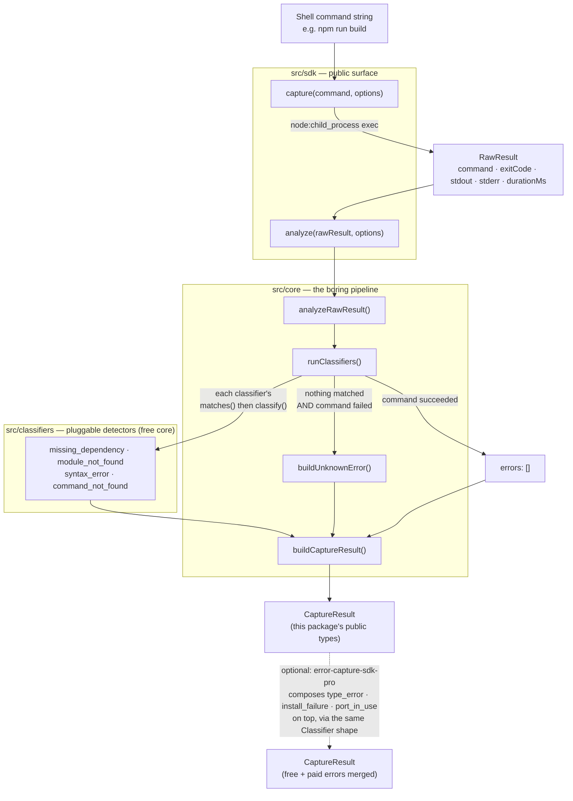

# ARCHITECTURE.md — Error Capture SDK

> Generated per `PROJECT_BRIEF.md` section 6, item 1. Describes the concrete module list,
> each module's responsibility and interface, the data flow, and the pipeline.
> If this drifts from the code, the code wins — but treat that as a bug to fix here.

---

## 1. The pipeline, in one sentence

`capture()` or `analyze()` turns raw command output into one predictable
`CaptureResult` by running it through: **capture → classify → output** (there is no
separate "parse" step — parsing is part of what each classifier's `classify()` does).

---

## 2. Module list

### `/src/types` — the contract

The schema everything else depends on. Pure types and interfaces, no runtime logic,
no imports from anywhere else in `src`. This is enforced by `.dependency-cruiser.cjs`
(`types-are-a-leaf`).

| File | Responsibility |
|---|---|
| `error-type.ts` | The closed 8-value `ErrorType` union. |
| `error-details.ts` | The type-specific `details` shape for each `ErrorType`. |
| `structured-error.ts` | `StructuredError` — a discriminated union on `type`, so `details` narrows per-type with no casting. Also carries `proHint: string \| null` — always `null` except sometimes on `unknown_error`. |
| `raw-result.ts` | `RawResult` — unclassified command output (`command`, `exitCode`, `stdout`, `stderr`, optional `durationMs`). |
| `capture-result.ts` | `CaptureResult` — the SDK's single, always-the-same-shape return value. |
| `options.ts` | `CaptureOptions` and `AnalyzeOptions`. |
| `classifier.ts` | The `Classifier` interface — the one contract every classifier implements. Lives here, not in `/core`, so classifiers can implement it without depending on `/core` (see `DECISIONS.md`). |

### `/src/classifiers` — the pluggable detectors

One file per error type, each implementing `Classifier` (`matches()` + `classify()`)
against `/types` only. Classifiers never import `/core`, `/sdk`, or each other —
enforced by `.dependency-cruiser.cjs`.

**Free core (this repo):**

| File | Detects |
|---|---|
| `missing-dependency.ts` | A bare package specifier that couldn't be resolved (tsc, plain Node `require`). |
| `module-not-found.ts` | A relative/absolute import path that couldn't be resolved. |
| `syntax-error.ts` | Invalid syntax (`TS1xxx`, or a plain Node `SyntaxError`). |
| `command-not-found.ts` | A shell command/binary that doesn't exist. |
| `index.ts` | The registered classifier list the core pipeline runs. The one file in this folder allowed to import its siblings — building this list is its whole job. |

**Paid tier (separate, private `error-capture-sdk-pro` package — not in this repo):**
`type-error.ts` (TypeScript semantic diagnostics), `install-failure.ts` (`npm
install` failures), `port-in-use.ts` (`EADDRINUSE`). These implement the exact same
`Classifier` shape against this package's exported `RawResult`/`StructuredError`
types and compose on top of the free core's `capture()`/`analyze()` output — no
changes to this package's architecture were made to support that.

`unknown_error` (ERROR_SCHEMA.md section 4.8) is **not** a classifier file — it's the
registry's built-in fallback (`src/core/unknown-error.ts`), guaranteeing every failed
command produces at least one `StructuredError` even when nothing else matches.

### `/src/core` — the boring core

The capture → classify → output pipeline itself. May depend on `/types` and
`/classifiers`, never on `/sdk`.

| File | Responsibility |
|---|---|
| `registry.ts` | `runClassifiers()` — runs every classifier's `matches()` then `classify()`, flattens results, and enforces the schema invariant that `errors` is `[]` whenever the command succeeded, regardless of what a classifier produced. |
| `unknown-error.ts` | `buildUnknownError()` — the fallback `StructuredError` for a failed command nothing else matched. Attaches `proHint` via `pro-hint.ts`. |
| `pro-hint.ts` | `buildProHint()` — a lightweight, best-effort pattern check (not the Pro classification logic itself) for whether an `unknown_error` looks like a Pro-tier category, used only to populate `StructuredError.proHint`. |
| `build-capture-result.ts` | `buildCaptureResult()` — assembles the final `CaptureResult` from a `RawResult` and its classified errors. |
| `pipeline.ts` | `analyzeRawResult()` — wires the above together: classify, then build. This is the one function both `analyze()` and `capture()` share, so the classify logic is never duplicated. |

### `/src/sdk` — the public surface

The tiny API surface a consumer actually imports. May depend on `/core` and
`/types`, never reaches into individual classifiers directly.

| File | Responsibility |
|---|---|
| `analyze.ts` | `analyze()` — pure `RawResult → CaptureResult`, via `core/pipeline.ts`. |
| `capture.ts` | `capture()` — runs a real command (`node:child_process` `exec`), builds a `RawResult`, delegates to `analyze()`. Never rejects for a failing command. |
| `usage-error.ts` | `UsageError` — thrown only for invalid arguments (e.g. an empty command string), not exported publicly (see `DECISIONS.md`). |
| `index.ts` | The actual public export list: `capture`, `analyze`, and the schema/option types. |

### `src/index.ts` — the package entry point

A one-line re-export of `src/sdk/index.ts`. This is what `import { capture } from
"error-capture-sdk"` actually resolves to (`package.json`'s `main`/`types` point at
its compiled output, `dist/index.js`).

---

## 3. Data flow

**Why there's no separate "parse" box:** each classifier's `classify()` does its own
parsing (regex over the combined `stdout`+`stderr`) as part of producing
`StructuredError[]`. Splitting "parse" and "classify" into separate pipeline stages
would mean inventing a shared intermediate representation across 7 very different
failure formats (tsc diagnostics, npm error codes, shell errors) for no real benefit
— the "boring core, no cleverness" rule (`PROJECT_BRIEF.md` section 4.3) favors the
simpler two-stage version actually implemented.

---

## 4. Module boundaries (enforced, not just documented)

`.dependency-cruiser.cjs` fails the build on any of these:

- `/types` cannot import `/core`, `/classifiers`, or `/sdk` — it's a leaf.
- A classifier file cannot import `/core`, `/sdk`, or another classifier file.
  `classifiers/index.ts` is the sole exception, since assembling the registry list
  is its entire job.
- `/core` cannot import `/sdk`.
- `/sdk` cannot import `/classifiers` directly — only through `/core`'s registry.
- No circular dependencies anywhere.

This is what makes "adding a new error type = adding one file, nothing else changes"
(`SDK_API.md` section 6) actually true rather than aspirational — see
`docs/CLASSIFIER_GUIDE.md`.
